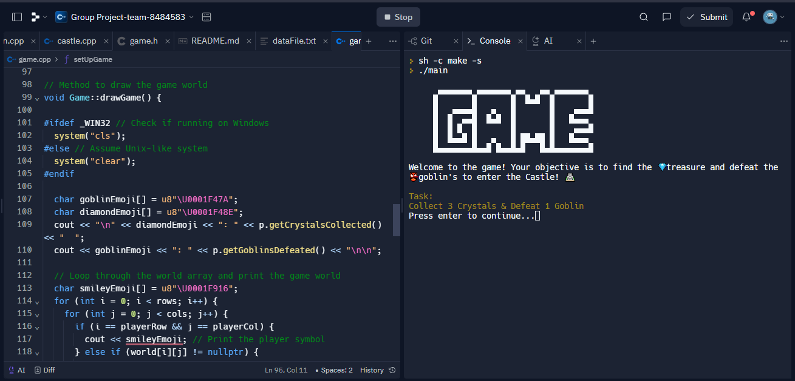
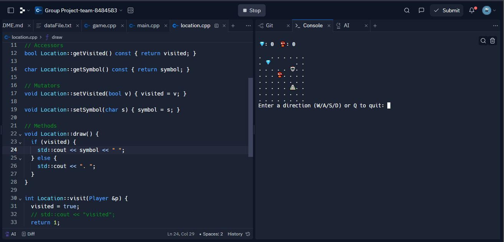

# Castle Siege (in C++)

## Objective

Welcome to the game! Your objective is to find the 💎 treasure and defeat the 👾 goblins to enter the 🏰 Castle!

## Task
Collect 3 Crystals & Defeat 1 Goblin

## Instructions

1. Move up: W, or w
2. Move left: A, or a
3. Move down: S, or s
4. Move right: D, or d
5. Quit game: Q, or q

To modify the game world configuration, follow these steps:

1. Open the `dataFile.txt` file in the project.
2. Edit the content of the file to specify the desired game world configuration.
3. Save the `dataFile.txt` file.

Please note that each character in the `dataFile.txt` file represents a location in the game world. Here's what each character represents:

- `o`: Empty space
- `r`: Crystal
- `g`: Goblin
- `c`: Castle

Make sure to update the characters in the `dataFile.txt` file according to your desired game world configuration.
